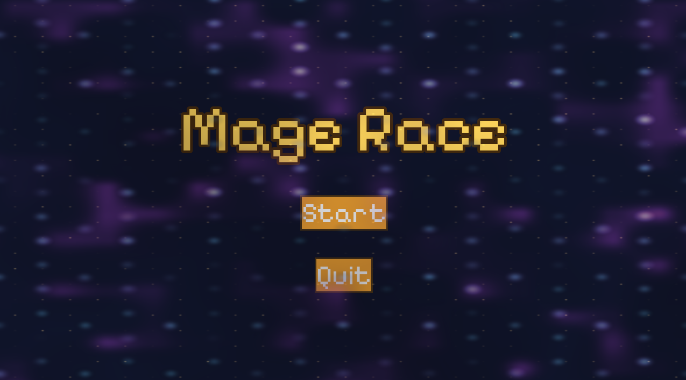
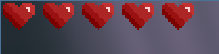
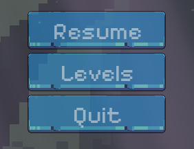

# Mage Race #

## Summary ##

**Mage Race is a 2D puzzle-platformer where players embark on a quest as a wizard to restore balance to the magical realm of Valenor. After dark mages stole relics and created evil spells, your role is to battle through treacherous levels spanning forests, ice caverns, and volcanic landscapes to defeat enemies and reclaim artifacts. Master your attacks while navigating through this challenging terrain to become the mage that saves Valenor!**

## Project Resources

[Try our Game!](https://sriramadhenu.itch.io/mage-race)  
[Proposal Document](https://docs.google.com/document/d/1TKdwR71jKnw42CS0OGpTujwn_lJmPJQjXw_Rr52OSoA/edit?usp=sharing)  

## Gameplay Explanation ##

**Controls:**

**Movement:**

* A - Move Left
* D - Move Right
* Space/W - Jump (Hold for increased height, let go for fast-fall)
* Left Shift/Right Shift - Dash (Can be used twice, has a cooldown of 1 second)

**Combat:**

* Left Click/F - Attack (Facing default direction)
* J - Attack Left
* L - Attack Right

* Menu:
* Esc - Pause Menu

**How to Play:**

**Launch the game to see the main menu, then press "Start". Choose between Forest, Ice, and the Lava levels. Each level can be replayed at any time, and the player can switch to a different level by navigating to the pause menu.**

**Health**

**You have 5 hearts everytime you start a level or respawn, which is displayed in the top-left corner. Taking damage from killzones, jumping off the map, or enemy attacks will either remove some or all of your hearts, so be mindful! If you die, you will automatically respawn at the start of the level after a 2-second death animation, with your hearts replenished.**

**Combat**

**Use your attacks to fight enemies from a safe distance, or dare to out-run them! Different enemies have different attack styles - experiment their movement and fighting logic to devise the most effective strategy.**

**Movement Tips**

**As for level navigation, remember to use the dash ability to cover long distances or escape danger. Holding horizontal and vertical movement (W/Space with A/D), as well as timing your dash(es) at the apex of your jump is recommended to cover the most amount of ground. Remember to disable the sticky keys shortcut (5x shift), if you have it enabled.**

**Add it here if you did work that should be factored into your grade but does not fit easily into the proscribed roles! Please include links to resources and descriptions of game-related material that does not fit into roles here.**

# External Code, Ideas, and Structure #

If your project contains code that: 1) your team did not write, and 2) does not fit cleanly into a role, please document it in this section. Please include the author of the code, where to find the code, and note which scripts, folders, or other files that comprise the external contribution. Additionally, include the license for the external code that permits you to use it. You do not need to include the license for code provided by the instruction team.

If you used tutorials or other intellectual guidance to create aspects of your project, include reference to that information as well.

# Team Member Contributions

This section be repeated once for each team member. Each team member should provide their name and GitHub user information.

The general structures is 
```
Team Member 1
  Main Role
    Documentation for main role.
  Sub-Role
    Documentation for Sub-Role
  Other contribtions
    Documentation for contributions to the project outside of the main and sub roles.

Team Member 2
  Main Role
    Documentation for main role.
  Sub-Role
    Documentation for Sub-Role
  Other contribtions
    Documentation for contributions to the project outside of the main and sub roles.
...
```

For each team member, you should include work of your role and sub-role in terms of the content of the course. Please look at the role sections below for specific instructions for each role.

Below is a template for you to highlight items of your work. These provide the evidence needed for your work to be evaluated. Try to have at least four such descriptions. They will be assessed on the quality of the underlying system and how they are linked to course content. 

*Short Description* - Long description of your work item that includes how it is relevant to topics discussed in class. [link to evidence in your repository](https://github.com/dr-jam/ECS189L/edit/project-description/ProjectDocumentTemplate.md)

Here is an example:  
*Procedural Terrain* - The game's background consists of procedurally generated terrain produced with Perlin noise. The game can modify this terrain at run-time via a call to its script methods. The intent is to allow the player to modify the terrain. This system is based on the component design pattern and the procedural content generation portions of the course. [The PCG terrain generation script](https://github.com/dr-jam/CameraControlExercise/blob/513b927e87fc686fe627bf7d4ff6ff841cf34e9f/Obscura/Assets/Scripts/TerrainGenerator.cs#L6).

You should replay any **bold text** with your relevant information. Liberally use the template when necessary and appropriate.

Add addition contributions int he Other Contributions section.

## Jacob Parker (DevBlocky)

**Main Role: AI/Behavior**

This game includes three enemies, a unique one for each level: The forest level has the orc, the ice level has the skeleton archer, and the lava level has the slime. The orc and skeleton archer enemies are implemented as state machines, which is one of the methods brought up in class for NPCs. These enemies were changed to the state machine behavior after the playtest because of feedback from people saying the enemies were too easy. You can find them implemented [here (orc_enemy.gd)](https://github.com/sriramadhenu/mage-race/blob/main/scripts/enemies/orc_enemy.gd) and [here (skeleton_enemy.gd)](https://github.com/sriramadhenu/mage-race/blob/main/scripts/enemies/skeleton_enemy.gd). For the skeleton archer, it also needed an arrow scene and a way to target the player (really the player's position). You can find the arrow implemented [here](https://github.com/sriramadhenu/mage-race/blob/main/scripts/projectiles/arrow.gd). Since the lava level is focused on platforming, the slime enemy just acts as an annoyance to the player by knocking them off platforms and damaging them if they get too close. The slime is simply implemented as a crawling enemy, it will rotate around a platform clockwise. You can find the slime implemented [here](https://github.com/sriramadhenu/mage-race/blob/main/scripts/enemies/slime_enemy.gd).

**Sub Role: Game Feel**

After feedback from the playtest, looking at the game feel slides, and consulting the team, we implemented many game feel improvements to our game. One of the areas we focused on was movement, specifically the jump. We implemented the ability to [cancel your jump](https://github.com/sriramadhenu/mage-race/blob/19eeb69c0e38be01fc40b611866efbef297cca0c/scripts/player/player.gd#L48-L49) (i.e. if you stop holding space, you start falling immediately) as well as [faster gravity when falling](https://github.com/sriramadhenu/mage-race/blob/19eeb69c0e38be01fc40b611866efbef297cca0c/scripts/character.gd#L108-L111). Preventing the player from [dashing through enemies](https://github.com/sriramadhenu/mage-race/blob/19eeb69c0e38be01fc40b611866efbef297cca0c/scripts/player/player.gd#L193-L202) was also implemented. Finally, the ice spell was improved so that it [followed the player while forming](https://github.com/sriramadhenu/mage-race/blob/19eeb69c0e38be01fc40b611866efbef297cca0c/scripts/player/player.gd#L104-L119) and only left the player's scene when fired.

**Other Contributions**

Since I was already working on projectiles, I implemented the [ice spell](https://github.com/sriramadhenu/mage-race/blob/main/scripts/projectiles/ice_spell.gd) that the player uses in the game. I also imported and setup the animation sprites for each of the characters (player and enemies).


## Sri Krishanu Ramadhenu (sriramadhenu)

**Main Role: Game Logic**

My main work was on the player, health, and level/respawn systems. I wired the player’s damage and knockback into a shared character health system so that taking damage reduces hearts, [emits a health-changed signal](https://github.com/sriramadhenu/mage-race/blob/799b07b00b38df7b2a8baa0cb287d3e943c158c7/scenes/ui/hud/hud.gd#L26-L30), and can trigger death and respawn [link (minus the _on_prevent_dash_zone_body_entered function)](https://github.com/sriramadhenu/mage-race/blob/116efa511dc15851b5f8b1537c40f7056614a5ad/scripts/player/player.gd#L164-L209). The [game manager](https://github.com/sriramadhenu/mage-race/blob/58be39db4ee792ece815b2e8c7f2b71eb4bd0a59/scripts/managers/game_manager.gd#L1-L74) keeps track of what level the player is currently on (or the pause/main menu), and makes changes to the entire system accordingly. The [level manager](https://github.com/sriramadhenu/mage-race/blob/58be39db4ee792ece815b2e8c7f2b71eb4bd0a59/scripts/managers/level_manager.gd#L1-L34) keeps track of the level that is being displayed and changes the scene accordingly.

**Sub Role: Build and Release Management**

For this role, I made a clear [workflow](https://github.com/sriramadhenu/mage-race/blob/main/README.md) for my teammates in the README.md. I was in charge of checking out feature branches pushed by my teammates and making sure things worked as they intended. If so, I then merged the develop build with their feature branch, taking care of conflicts when they occured, and tested once again to ensure the combined build ran without issues. Finally, if everything worked, I pushed the changes to the develop branch. Therefore, the develop branch contained a playable version with updated work from every role each week.

Here is the list of commits I (SaltyGamer829) made to develop (Not sure why it addresses me by my old github username, as my new one is actually sriramadhenu):
[Develop branch commit history](https://github.com/sriramadhenu/mage-race/commits/develop)

This role required me to communicate with my teammates a lot about work that has been committed, as well as changes that need to be made in each role before I can merge to develop. Oftentimes, I tried to look into these changes myself, so I will list the most important contributions/additions in the next section. All in all, I learned a lot about version control and team collaboration.

**Other Contributions**

I created the final obstacle in the forest level, adding a collision shape to a button that removed a purple barrier with a fading animation when the player contacted the button (the animation took me too long to figure out, I'm not a visuals person). [button file](https://github.com/sriramadhenu/mage-race/blob/116efa511dc15851b5f8b1537c40f7056614a5ad/scenes/levels/green_button.gd#L1-L17). [wall file](https://github.com/sriramadhenu/mage-race/blob/116efa511dc15851b5f8b1537c40f7056614a5ad/scenes/levels/purple_wall.gd#L1-L10).

I also modified the player controls to implement [directional shooting](https://github.com/sriramadhenu/mage-race/blob/116efa511dc15851b5f8b1537c40f7056614a5ad/project.godot#L61-L76), [paused movement while attacking (grounded)](https://github.com/sriramadhenu/mage-race/blob/116efa511dc15851b5f8b1537c40f7056614a5ad/scripts/player/player.gd#L50-L63), [and mechanics that didn't allow dashing and shooting simultaneously].

I added [killzones](https://github.com/sriramadhenu/mage-race/blob/116efa511dc15851b5f8b1537c40f7056614a5ad/scripts/killzone.gd#L1-L16) to each level, so if the player jumped off the map and came in contact with this zone below the map, they would lose all their health.

Similarly, I added [spikes](https://github.com/sriramadhenu/mage-race/blob/58be39db4ee792ece815b2e8c7f2b71eb4bd0a59/scenes/levels/ice_spikes.gd#L1-L16) that hurt the player and caused knockback in the ice level.


## Dunh Adam Lee (dunhlee)

**Main Role: UI**

As the UI designer, I wanted to ensure that our UI elements matched the feeling of our game art. Since Mage Race uses pixel art, I figured it was best to keep things cohesive by having our UI also be pixel themed. To do that, for the Main Menu and the Pause Menu, I made a [pixel_theme.tres](https://github.com/sriramadhenu/mage-race/blob/ee99234c252524eace5437f33d643e3682d93cd3/scenes/ui/common/pixel_theme.tres#L1) to keep the UI consistent with our art style.

I'll go over my design choices and challenges in the work I've done.

### Main Menu



The main menu is our entry point to the game. While designing this menu, my biggest challenge was finding a way to convey the feel of Mage Race. I wanted the menu to express the mysticism of our player character. I also wanted there to be animations in the menu. One solution I thought of was to use a looping video of our gameplay, but I also thought that it would be repetitive to present something that the player will see anyway. Therefore, I instead decided to use shaders. Shaders allow movement and programmatic artistic expression.

#### The Menu Background

The background consists of a foundational navy blue ColorRect component and 3 shaders that are layered on top of it.

The first shader is [backshader.gdshader](https://github.com/sriramadhenu/mage-race/blob/ee99234c252524eace5437f33d643e3682d93cd3/scenes/ui/menus/shader_scripts/back.gdshader#L1). It renders a subtle mist-like energy that moves slowly in the background. It is very hard to notice, but I believe that it completes the atmosphere that I'm going for in this background.

The next shader is [energy.gdshader](https://github.com/sriramadhenu/mage-race/blob/ee99234c252524eace5437f33d643e3682d93cd3/scenes/ui/menus/shader_scripts/energy.gdshader#L1). This shader is the star of the show. The particles were made by splitting UV coordinates of the screen into smaller regions. These regions are then filled with glowing points and are animated upward with respect to time. There is also a shimmer effect to give the particles a pulsating glow effect, and combined with sine and cosine functions, we get a nice, modulating shimmer effect that represents magical energy.

The last shader is [stars.gdshader](https://github.com/sriramadhenu/mage-race/blob/ee99234c252524eace5437f33d643e3682d93cd3/scenes/ui/menus/shader_scripts/stars.gdshader#L1). This shader adds the finishing touch to the background by adding small orange stars.

### Player Health and Hearts

When designing the player health, I needed to decide whether the health should be a bar or segmented. Initially, I opted to go with a bar because Godot has built-in progress bar nodes that make the implementation easy. However, I decided to go with a segmented health bar because I was inspired by Hollow Knight: Silksong. Plus, I wanted to try Godot's animation player.

#### Hearts



For hearts, I implemented 3 animations:

- **Pop in** – To animate hearts being restored when the player respawns  
- **Pop out** – To animate hearts when the player takes damage  
- **Low health pulse** – To animate hearts when the player is low health  

A heart acts depending on the [heart.gd](https://github.com/sriramadhenu/mage-race/blob/ee99234c252524eace5437f33d643e3682d93cd3/scenes/ui/hud/heart/heart.gd#L1) script. This script defines a heart's behavior (whether to pop-in or pop-out). [player_health.gd](https://github.com/sriramadhenu/mage-race/blob/ee99234c252524eace5437f33d643e3682d93cd3/scenes/ui/hud/player_health/player_health.gd#L1) is the player health HUD manager. It communicates with our `GameManager.gd` to create the player's hearts and track the current health. It decides which hearts are full, empty, and when to play the low health animation.

### Pause Menu



The pause menu builds upon the theme of the game. It keeps the pixel art style by implementing the pixel theme.  
It has 3 options:

- Resume (Resume the game)  
- Levels (Go to the level loader)  
- Quit (Quit the game)

The [pause_menu.gd](https://github.com/sriramadhenu/mage-race/blob/ee99234c252524eace5437f33d643e3682d93cd3/scenes/ui/menus/PauseMenu/pause_menu.gd#L1) script handles the transitions between the buttons, and the pausing of the game state.

### HUD
To ensure that the HUD is persistent across all levels without any node/code repetition, I autoloaded a [hud.tscn](https://github.com/sriramadhenu/mage-race/blob/2168b7a2bde5dfc8892afc82fcbb4bafbb8ee454/scenes/ui/hud/HUD.tscn#L1) in the project settings. This is the scene that ties the player health and pause menu together for our levels. 

The [hud.gd](https://github.com/sriramadhenu/mage-race/blob/ee99234c252524eace5437f33d643e3682d93cd3/scenes/ui/hud/hud.gd#L1) script controls which HUD elements show up depending on the scene the player is in. 
 
**Sub-Role: Gameplay Testing**

For the sub-role, it was difficult to gauge when to properly test our game because we were behind in development. It was difficult to determine whether testing would actually give us meaningful feedback, given our core mechanics and level structure weren't fully in place yet. I didn't want playtest sessions to turn into level design sessions driven by our playtesters. By the time our class had the game testing discussion, we did have a level ready to be tested, which gave us a lot of helpful feedback.

**Other Contributions**

#### Game Camera

For the game camera, a pure position lock camera seemed too stiff, so I decided that it was best if we use the [position_lock_lerp.gd](https://github.com/sriramadhenu/mage-race/blob/ee99234c252524eace5437f33d643e3682d93cd3/scenes/levels/position_lock_lerp_camera.gd#L1)
 camera from exercise 2. I simply adapted the implementation of my camera from exercise 2 into our game.

#### Audio

I added a royalty-free fantasy soundtrack to the main menu to fit with the theme of the game's atomosphere.

#### Level Backgrounds

For our level backgrounds, I chose to use parallax backgrounds because they look nice and they make our levels more immersive by simulating a living environment. The biggest challenge here was finding good free assets that match the theme of our levels. However, after finding the appropriate assets, setting up the backgrounds with Godot's ParallaxBackground and ParallaxLayer nodes makes the implementation very easy.

#### Resources

- [How to use Godot Themes](https://docs.godotengine.org/en/stable/tutorials/ui/gui_using_theme_editor.html)  
- [Learning how to use AnimationPlayer](https://docs.godotengine.org/en/stable/tutorials/animation/introduction.html)  
- [Using Parallax Backgrounds](https://www.youtube.com/watch?v=RYsUgJuICE4)